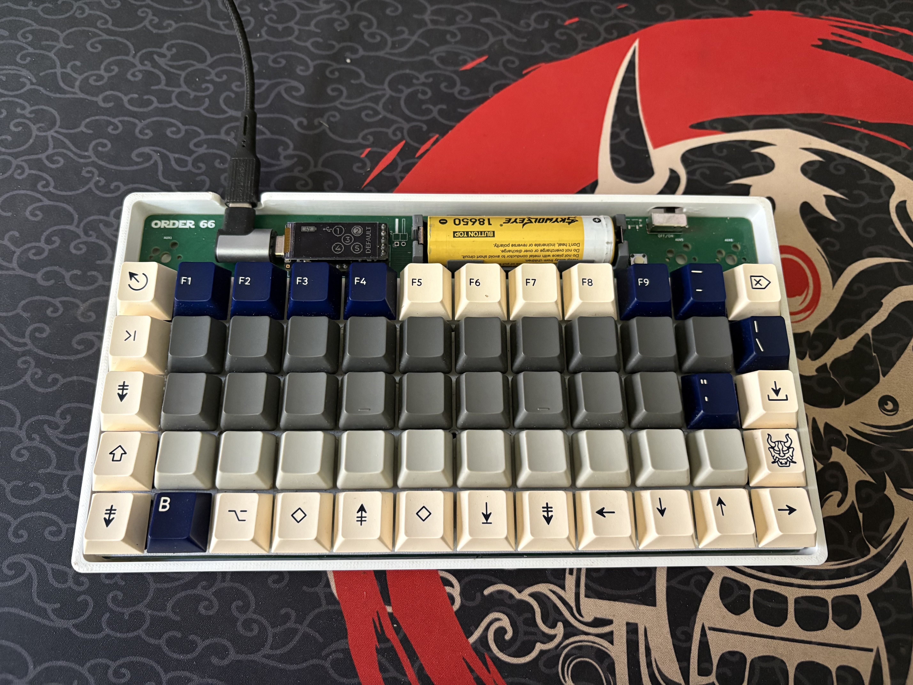

# order66keyboard

BUILDING THIS KEYBOARD

checkout this repo
```
git clone git@github.com:rileytuttle/order66keyboard.git
```

HARDWARE - the assumption here is that you have one of my extra pcbs from the small batch fabrication that I used.
otherwise I guess you could have your own made but I doubt that will happen.
note the version of board you have. I forgot to do this with version 1 so if there is no version then you have a v1.0

next step would be to solder the components on
* solder key hotswap sockets
* solder diodes, currently there are two options (either the smd or DO-35 through hole type). make sure to match cathode with silkscreen marking
* choose what kind of battery you want there is an option for a flat type battery using a jst connector or a 18650 battery with a socket.
* choose the battery toggle switch type
* optionally solder sockets for nice!nano
* solder riser socket for nice!view

CASE
* check out the tag corresponding to the version of pcb you have ie `git checkout v1.0` ... use `git tag` to see tags and `git show tagname` to see the annotations. then `git checkout <VERSION_TAG>`
* then open the case.scad file in openscad. there you will be able to choose features corresponding to the optional hardware you have. export the case stl
* export the keygrid stl
* print the files

[Build Photos](./build-photos/)
[](./build-photos/IMG_3964.jpg)

SOFTWARE
* check out the tag corresponding to the pcb version we have
* follow instructions [here](https://zmk.dev/docs/development/local-toolchain/setup/container) to set up zmk devcontainer
* then once in zmk container app folder do this
```
west build -p -b nice_nano_v2 -- -DSHIELD="order66 nice_view_adapter nice_view" -DZMK_EXTRA_MODULES="/workspaces/zmk-modules/order66-shield"
```

NOTE:
once I fix how I created the zmk shield I should be able to move to the "normal" zmk firmware build method. but for now we have to use the local build environment.
